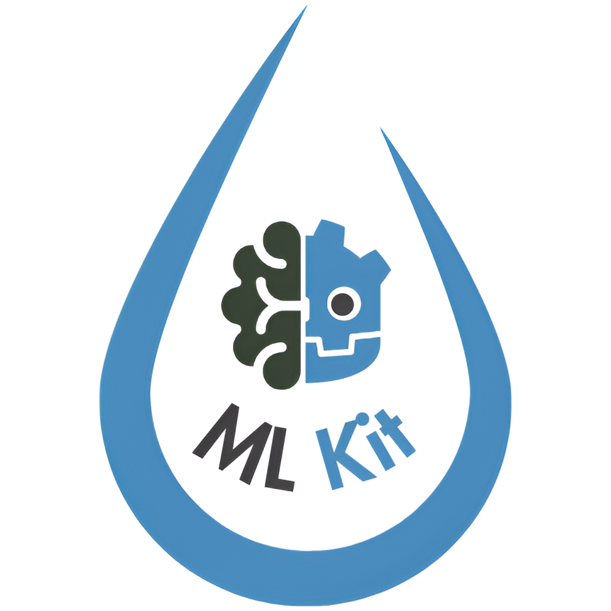

# MLGodotKit

**Empower your Godot projects with the power of machine learning!**  
Given the recent advancements in Ai this plugin aims to take a stab at integrating core 
machine learning fundamentals directly inside godot to power large scale Ai work flows
from agentic Ai to reinforcement learning and everything in between.

<p align="center">
  
</p>

> *If you'd like to see something else add an issue!*

## Getting Started

To install the plugin in your Godot project:
- Download the *addons* package from the official [Godot Asset Library](https://godotengine.org/asset-library/asset/4060).
- Extract the downloaded archive.
- Locate the `mlgodotkit` folder inside the extracted contents.
- Copy the `mlgodotkit` folder into your project directory under a folder named `addons`:

```
your_project/
└── addons/
    └── mlgodotkit/
```

If the `addons` folder does not exist, create it at the root of your project.

Enable the plugin in Godot:
- Open your project in Godot.
- Navigate to **Project $\rightarrow$ Project Settings $\rightarrow$ Plugins**.
- Find the plugin in the list and click **Enable**.

The plugin is now installed and ready to use.

See the full documentation [here](https://mlgodotkit.readthedocs.io/en/latest/).

---

## Credits
Built on the powerful [Eigen C++ library](https://eigen.tuxfamily.org/).