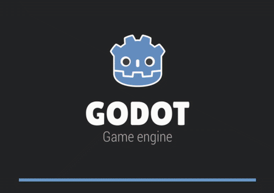

WebAssembly Support
===================

MLGodotKit provides **WebAssembly (WASM) support**, allowing projects that use the toolkit
to run directly in the browser using Godot’s Web export pipeline.

This enables:
- Interactive AI demos without native builds
- Easy sharing of experiments and examples
- Real-time, in-browser learning demonstrations

Building for Web
----------------

MLGodotKit includes prebuilt **WASM-compatible GDExtension binaries**.
When exporting a Godot project for the Web, these binaries allow models
and learning logic to execute entirely in the browser.

The exported web build for the included demo can be found at::

   examples/NNPong/web/

Web Demo
--------

A live WebAssembly demo is available showcasing real-time learning:

- Play as the **red paddle**
- Compete against the **blue AI paddle**
- The AI starts with poor performance and improves over time

`Launch Game in Browser <https://fastidious-biscochitos-90f618.netlify.app>`_

This example demonstrates:
- Neural network inference in the browser
- Online learning during gameplay
- Practical use of MLGodotKit in a web environment

Reference
---------

For details on compiling and exporting GDExtensions for the web, see the official Godot documentation:

`Godot Docs – Compiling GDExtensions for Web <https://docs.godotengine.org/en/stable/contributing/development/compiling/compiling_for_web.html#gdextension>`_

